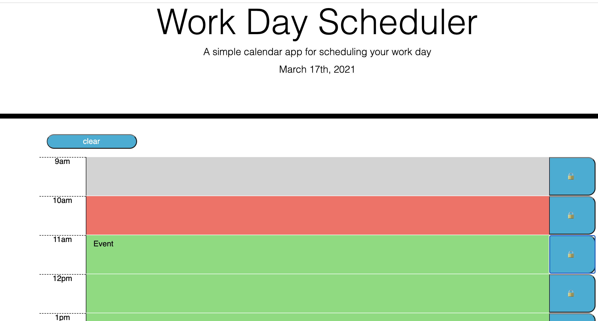
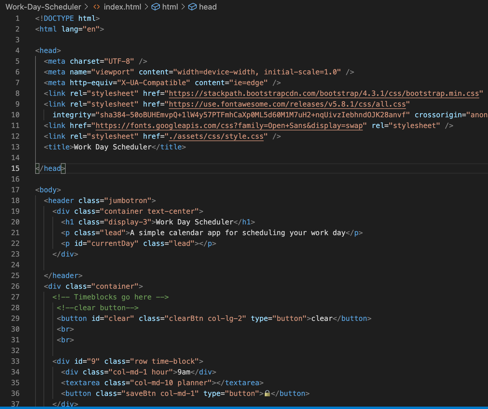

# Work-Day-Scheduler
# Coding-Quiz-Challenge

## Table of Contents
1. [Title](#title)
2. [General Info](#general-info)
3. [Technologies](#technologies)
4. [Installation](#installation)
5. [Collaboration](#collaboration)
6. [Steps](#Steps)

## Title
Work Day Schedule

## General Info
The purpose of this task is to create a calendar application that allows a user to save events for each hour and will be able to store the events within the browser local storage.

## Technologies 
The site uses HTML, CSS code, Javascript

## Installation
To access the website go to https://melelson.github.io/Work-Day-Scheduler/

To clone https://github.com/MelElson/Work-Day-Scheduler

# Collaboration 
Pull requests are encouraged. Please make sure to update as appropriate 

# Steps
Steps taken by user
	• User is given a planner and the current date displayed at the top of the page. 
	• The user is presented timeblocks for standard business hours. 
	• The time block is color coded to indicate past, present and future.
	• When a user clicks on a time block they enter and event. 
  • When the user clicks on the lock the event is stored in the browser's local storage.
	• When the user clicks on clear button the local storage is cleared.

The following animation demonstrates the application functionality:

    

### Planner

### Screenshot Event

### Screenshot Code

